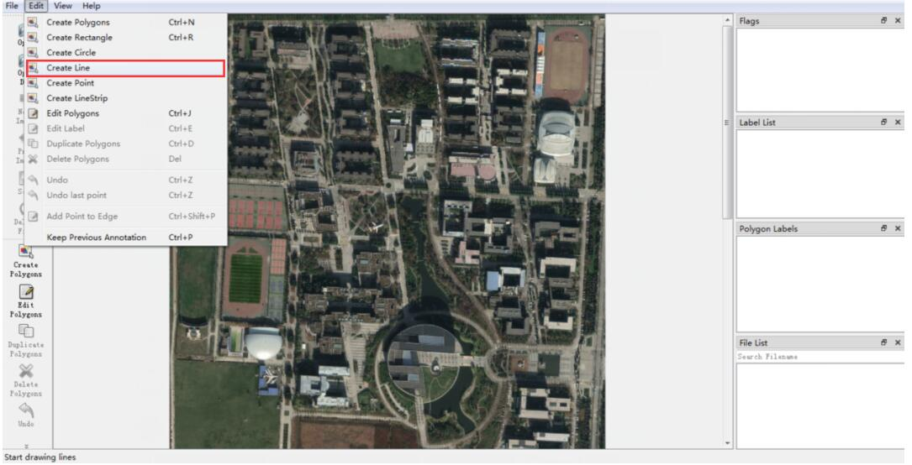
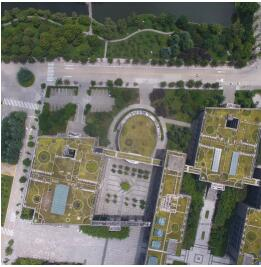
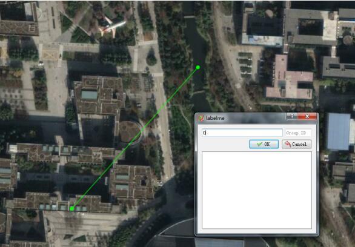

# 一起来制作你的遥感数据集吧

让我们来做一些多源遥感地理数据集。

## 现实主义数据集 RealScene

一个简单的例子：首先我们有一群无人机在天上往下拍的数据，存放在目录A里。然后包含整一个区域的完整卫星图放在目录B中。

目录A：里面的每张图片都是按顺序编号的 例如1.jpg 2.jpg 等等    
目录A+: 运行里面的 patch_cropping.py文件中的crop_dir函数（把输出目录设置成目录A+）,这样A+中就存在了中心方形裁切后的结果【注意下用不同的摄像头还要注意手动调裁剪后的图片大小】 （是的！我们更偏爱正方形的图像）    
目录B:里面存放了一张遥感卫星大图，从软件“图新地图”中下载的图像 后缀是 .tif

然后接下来我们需要在卫星图里把我们拍摄到的场景标出来

### 利用标注工具labelme 获得标注的json文件
* windows下安装标注工具labelme

快捷安装方式：anaconda环境下的

` pip --default-timeout=100 install QtPy PyQt5 `  
` pip install labelme `

如果遇到错误 “qt未绑定的问题”，需要uninstall QtPy PyQt5然后重新安装一遍
    打开方式：安装成功后在cmd命令行中输入 labelme 打开

* 其他安装 
    
    参见labelme的官方 https://github.com/CSAILVision/LabelMeAnnotationTool

* 用labelme打开 目录B中的 .tif 文件。

    使用线标注   

根据无人机图的编号，进行标注。只需在卫星图上按照无人机图的左上角到右下角的点，划拉出一条斜线！ 
【注意！！！先点左上角 再点右下角！！】  
【重要！！！】  
【重要！！！】  
【重要！！！】  

例如对于下面这个图  

就该这样画：

标注这条线，并且在弹窗内填写图的编号（例如这张图是0.jpg，就写0）

* ctrl+s 保存json文件。会在当前目录下生成一个json文件。（隔段时间记得保存一下）

*  把所有图标注完了以后，把这些个json存到目录C。

遇到不是俯视视角拍的图，或者其他有问题的图，直接跳过不用标注，但是记录一下编号

### 把相应的标注区域裁切保存下来，保存到目录D

运行patch_cropping.py文件里面的main函数

